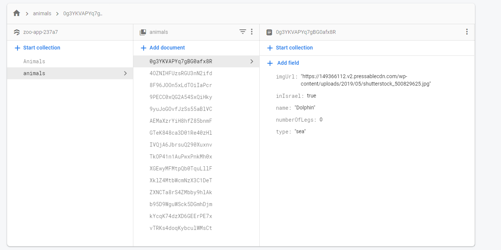

# Zoo Website - final project in react.js

> NOTE: ALL RIGHTS RESERVED TO SHIR FELDMAN

#### <ins>Using</ins>
* Front:
   - Full-Stack-web
   - Bootstrap
  
* Back:
   - Firebase
   - nodemon
<br>

#### <ins>Home Page:</ins>

 
<br> 

#### <ins>Category Page:</ins>
 
<br>

#### <ins>Sea Page:</ins>
 
<br>

#### <ins>Land Page:</ins>
 
<br>

#### <ins>Air Page:</ins>
 
<br>

#### <ins>Add new animal:</ins>
 
<br>

#### <ins>Details:</ins>

<br>

#### <ins>Change Details:</ins>

<br>

#### <ins>Navbar & Footer:</ins>


<br>

#### <ins>Firestore in firebase:</ins>


<br><br><br>


#### <ins>Run </ins>
> **_NEED TO INSTALL DEPENDENCIES!_**


run in terminal:
```js
npm i
```

then in terminal run:
```js
npm start
```
good to go have fun!


