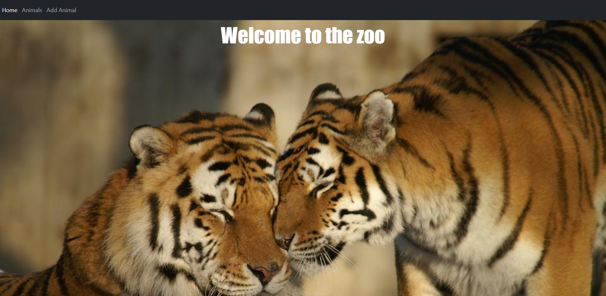
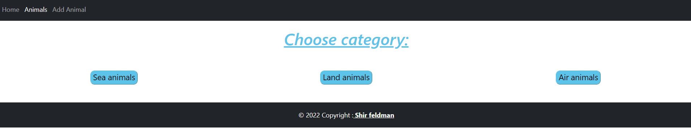
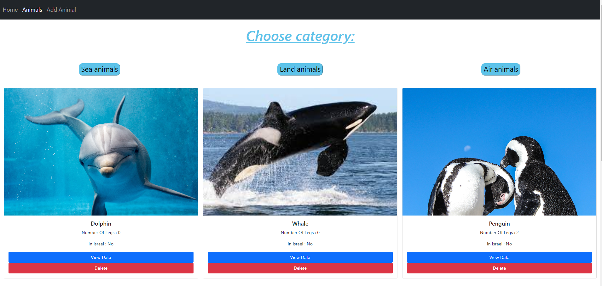
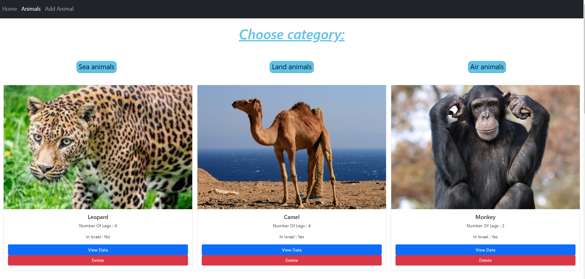
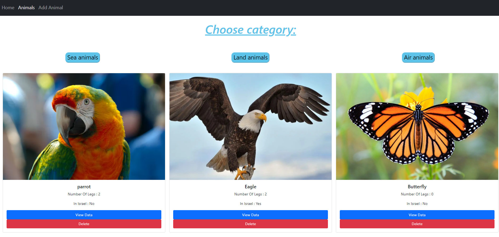
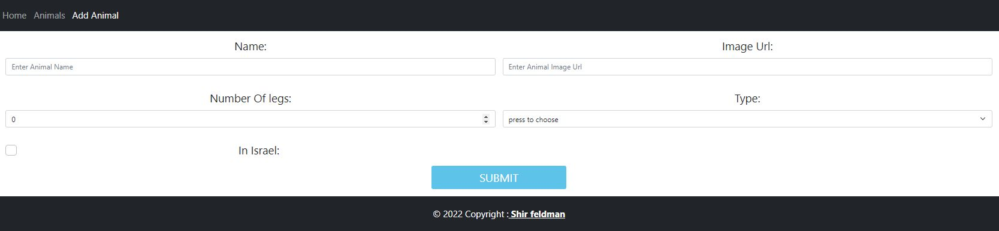
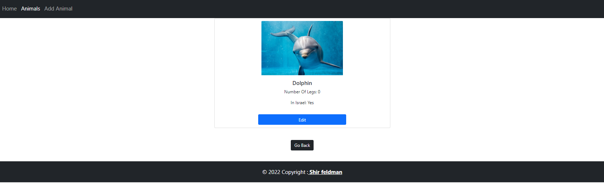
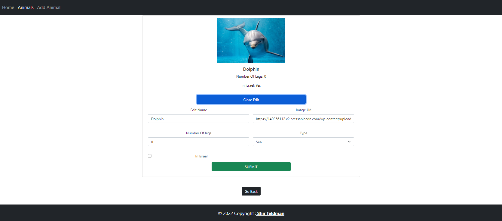
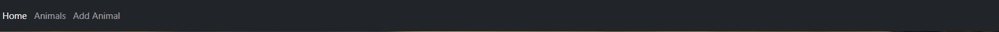
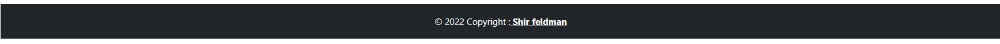

# Zoo Website - final project in react.js

> NOTE: ALL RIGHTS RESERVED TO SHIR FELDMAN

### Home Page:

 
  

### Category Page:
 
 

### Sea Page:
 
 

### Land Page:
 
 

### Air Page:
 
 

### Add new animal:
 
 

### Details:

 

### Change Details:

 

### Navbar & Footer:

   

## Available Scripts

In the project directory, you can run:
 `npm start`

